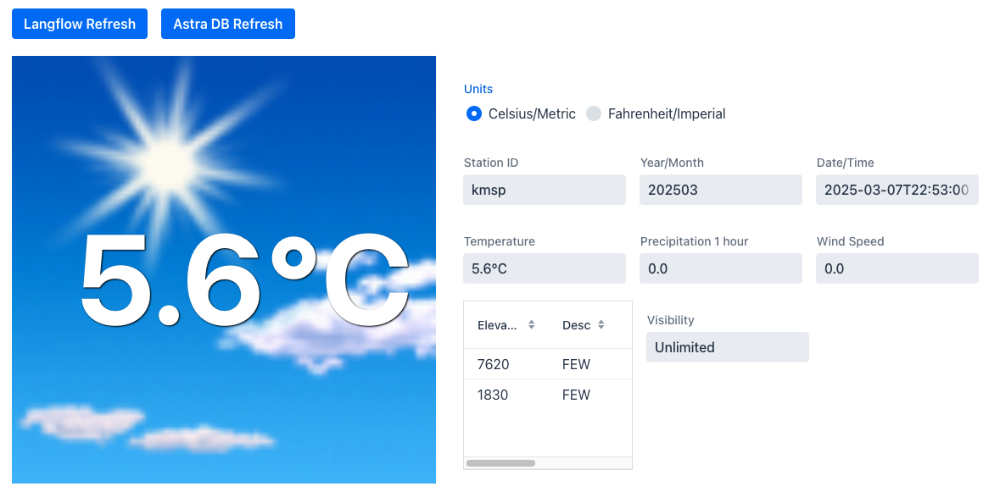

# WeatherApp
A simple weather application intended to be run on a Raspberry Pi. This application interacts with the National Weather Service (NWS) API, and retrieves data to be served by the application out of a DataStax Astra DB database. It also interacts with a DataStax Langflow Agent flow. Both the database and agent must be built ahead of time.



## Database

This application requires a running [Astra DB](https://astra.datastax.com) cloud database. The "free tier" of Astra DB should provide more than enough resources to run the application. If the Astra database is "hibernated," it will need to be "resumed" before running the applicaiton.

It is recommended to name the keyspace `weatherapp`. Really, the keyspace can be named anything, but any changes need to be reflected in the controller code.

Inside the keyspace, create a non-vector-enabled collection named `weather_data`.

A token from an appropriately-scoped role is required to be generated, as is the Astra Database's specific Data API endpoint.

The Langflow Agent flow can be quickly created by creating a new flow, and selecting the "Simple Agent" template. That's really all there is to it. Be sure to click on the "API" tab, and make note of the flow's Langflow API endpoint. The same token generated in the above step will work just fine.

## Environment:

This application requires the following environment variables to be set:

 - **ASTRA_DB_APP_TOKEN** - The token obtained from Astra DB.
 - **ASTRA_DB_API_ENDPOINT** - The Data API endpoint for the specific instance of Astra DB.
 - **ASTRA_LANGFLOW_URL** - The Langflow API endpoint for the specific flow.

In a Mac/Linux/Raspberry Pi OS environment, the environment varaibles can be set from a terminal like this (example):

```
export ASTRA_DB_API_ENDPOINT=https://not-real-us-east1.apps.astra.datastax.com
export ASTRA_DB_APP_TOKEN=AstraCS:wtqNOTglg:725REAL238dEITHER563486d
export ASTRA_LANGFLOW_URL=https://api.langflow.astra.datastax.com/lf/6f-not-real-9493/api/v1/run/060d2-not-real-caef?stream=false
```

## To build:

### Build Requirements

 - Java 17 (JDK)
 - Maven
 - dependencies for Spring Boot and Vaadin

### Build command

    mvn clean install -Pproduction

### Running the build

    java -jar target/weatherapp-0.0.1-SNAPSHOT.jar

## Usage:

The Weather Application is exposed locally at [http://127.0.0.1:8080](http://127.0.0.1:8080). It also has restful endpoints which allow it to both fetch and display data. When the application first comes up, it will not show any data. To remedy this, click the "Refresh" button. If data is present for the current month, the most-recent weather reading will be displayed. If there is no data for the current month, nothing will be displayed. See the _Loading Data_ step below.

*Note: The station code of "kmsp" (for the Minneapolis/St. Paul International Airport) is the default in this application. Additional station codes can be found at the official NWS website: [https://forecast.weather.gov](https://forecast.weather.gov), such as "knyc" (for New York City's Central Park weather station).*

### Loading Data:

The most-recent reading from the NWS can be loaded into the application by invoking the following _PUT_ endpoint (Weather Application needs to be running): [http://127.0.0.1:8080/weather/latest/station/kmsp](http://127.0.0.1:8080/weather/latest/station/kmsp).  This can be run using the [curl](https://www.curl.se) utility:

    curl -X PUT http://127.0.0.1:8080/weather/latest/station/kmsp

### Viewing Data:

In addition to the user interface, the most-recently loaded weather reading from the NWS (stored in the Weather Application's database) can be viewed on the following _GET_ endpoint: [http://127.0.0.1:8080/weather/latest/station/kmsp/month/202503](http://127.0.0.1:8080/weather/latest/station/kmsp/month/202503).  Note that the month is specified in the `YYYYMM` format.

    curl -X GET http://127.0.0.1:8080/weather/latest/station/kmsp/month/202503

